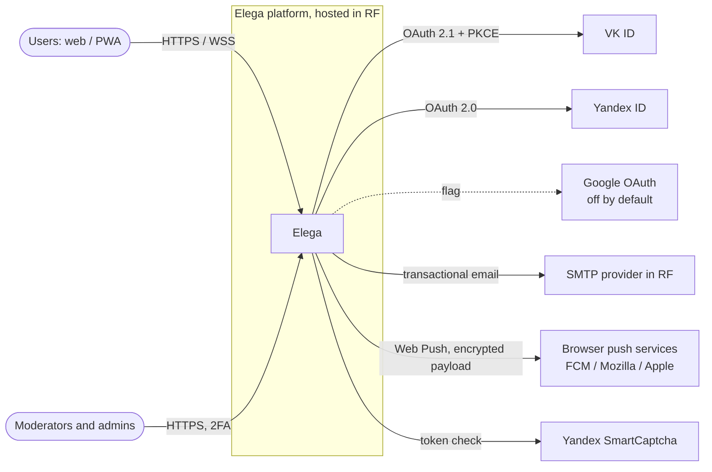
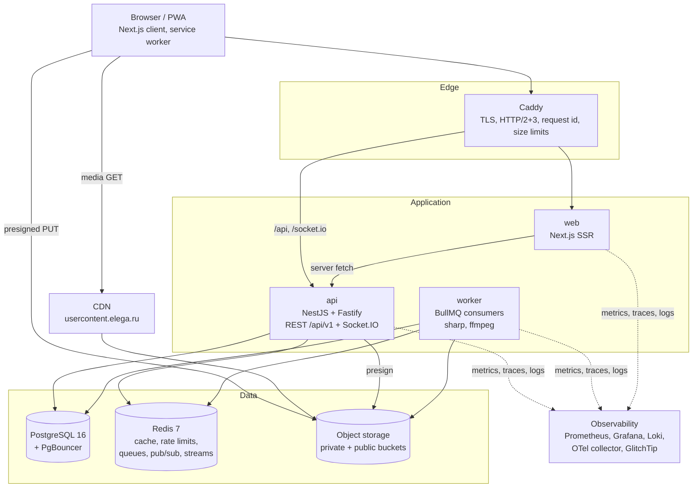
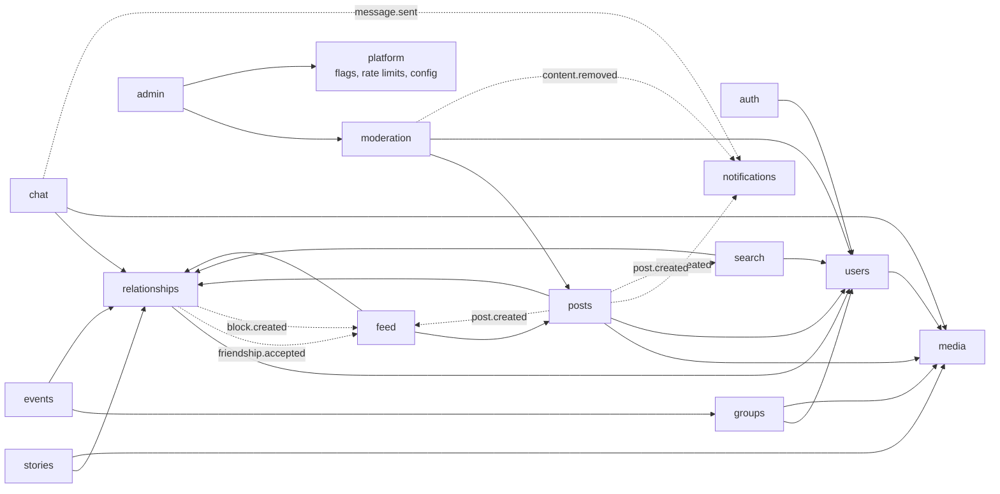
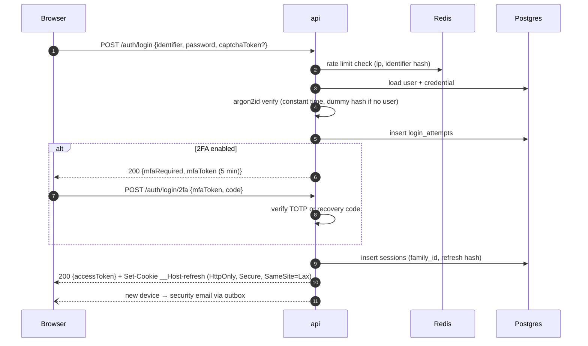
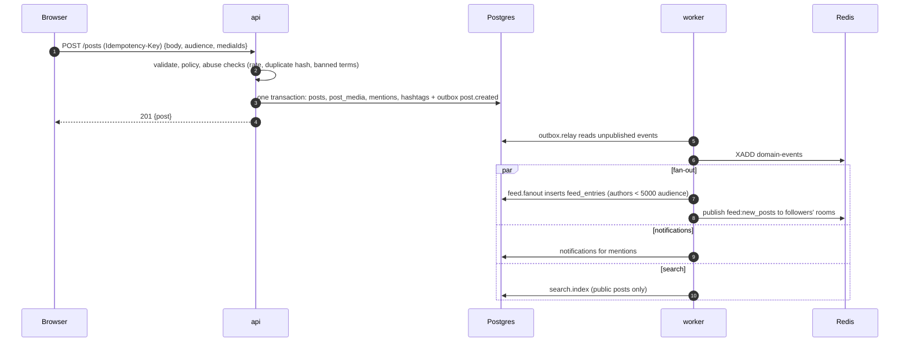
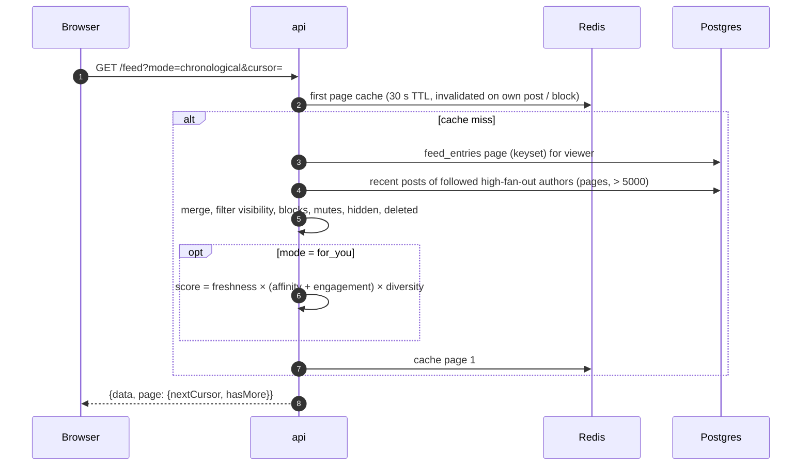
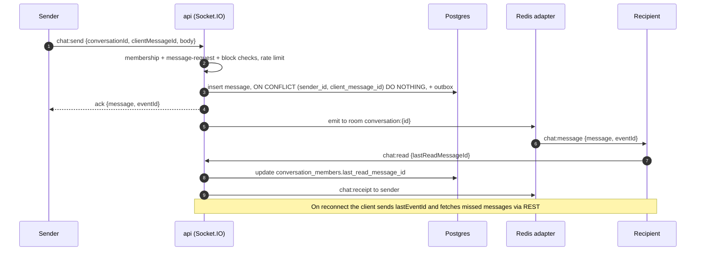
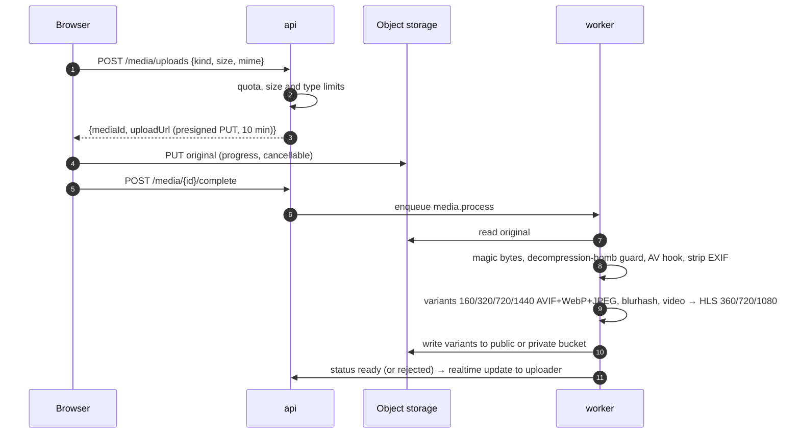
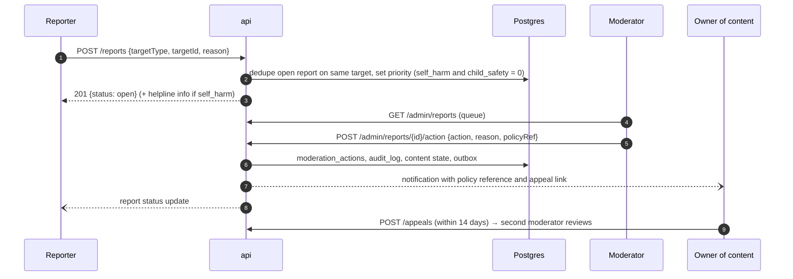
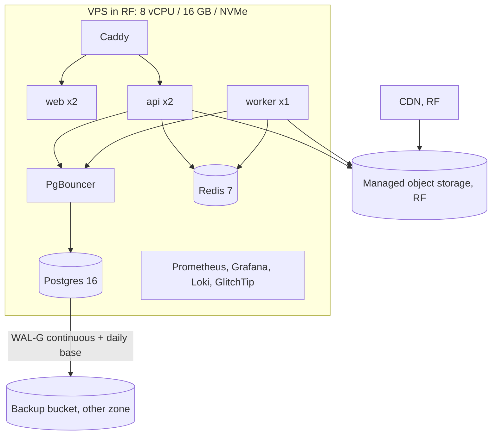

# Architecture

Status: accepted with the Step 2 blueprint. Decisions are recorded in [`docs/adr`](adr/).

Elega is a modular monolith: one NestJS API process (HTTP + WebSocket), one worker process
from the same codebase, PostgreSQL, Redis and S3-compatible storage, all hosted in Russia.
The web app is a Next.js PWA. Services are extracted only when metrics justify it
([ADR-001](adr/001-modular-monolith.md)).

## System context

Web Push payloads are end-to-end encrypted to the browser (RFC 8291) and carry no message
text, only a notification id the client fetches from the API. Push services outside the RF
still see the subscription endpoint and timing; that residual transfer goes on the legal
checklist. Google login stays behind a flag because it means cross-border transfer
([ADR-011](adr/011-login-providers.md)).

## Containers

User content is served from a separate registrable domain (`elega-usercontent.ru` or
similar) rather than a subdomain, so uploaded files can never read or set `elega.ru`
cookies. The brief suggests `usercontent.elega.ru`; a subdomain shares the registrable
domain, so it is weaker isolation. This is a deviation recorded in
[ADR-006](adr/006-media-pipeline.md).

## Module dependencies

Arrows mean "calls the public service of". Reactions to other modules' changes go through
domain events (outbox), drawn dashed.

Every module may depend on `platform`. The visibility check that every content query uses
(audience × relationship × blocks × minors) lives in `relationships` as one public function,
`VisibilityService.filterVisible(viewer, items)`, plus a SQL fragment builder for list
queries, so no module reimplements block rules (brief §10.4).

## Request lifecycle

1. Caddy terminates TLS, assigns `X-Request-Id`, enforces body size per route.
2. Fastify middleware: request id into the pino logger and OTel span, security headers,
   rate limit (Redis sliding window per IP, user and endpoint class).
3. Auth guard verifies the access JWT and loads the principal (user id, role, session id,
   minor flag, trust level).
4. Zod validation pipe with schemas from `packages/shared`.
5. Policy guard (CASL) checks the action on the specific resource; loaders fetch the
   resource once and pass it on.
6. Controller → service → repository (Drizzle).
7. Side effects written to `outbox` in the same transaction.
8. Response mapped through explicit DTOs.
9. Exceptions mapped to the unified error format with the request id.

## Sequences

### Login (password, with 2FA)

### Create post

### Feed load

### Send message

### Upload media

### Report content

## Deployment

### MVP: one server

Docker Compose, rolling restarts per service, migrations as a separate one-shot container
before rollout. Sizing is a starting point for the closed alpha, revisited after the k6 run.

### Scale path

Managed PostgreSQL with a read replica and managed Redis, API and worker on Kubernetes
(Helm chart from M12), media workers in their own node pool. Triggers from brief §37.6:
DB CPU > 60 % for 1 h, queue lag > 1 min, WebSocket connections > 20 k per node.
