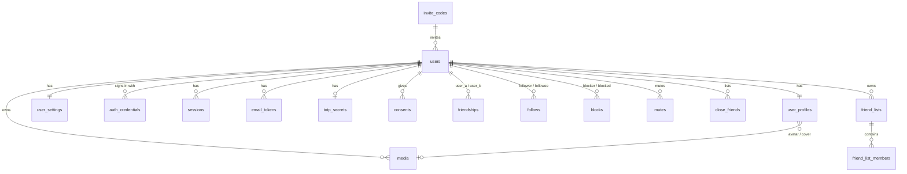
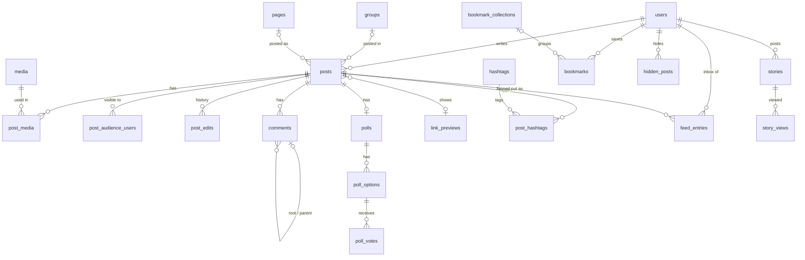
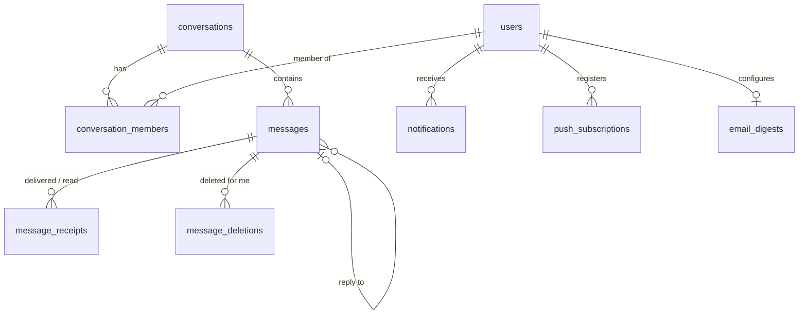
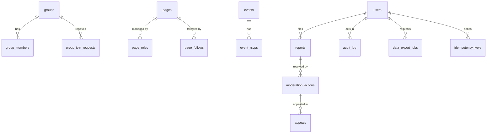

# Database

Status: Step 2 blueprint draft. The schema lives in
[`docs/database/0001_initial_schema.sql`](database/0001_initial_schema.sql) and was applied
cleanly to an empty PostgreSQL 16.14 database. At M0 it is split into Drizzle-managed SQL
migrations ([ADR-002](adr/002-orm-drizzle.md)).

## Conventions

| Rule | How |
| --- | --- |
| Primary keys | UUIDv7 (`uuid`), generated in the app; `uuid_generate_v7()` is the DB fallback ([ADR-009](adr/009-id-strategy.md)) |
| Timestamps | `created_at`, `updated_at` (`timestamptz`, UTC) on every table; `updated_at` maintained by trigger |
| Enumerations | `text` + `CHECK`, not PG enums (adding a value is a plain migration) |
| Soft delete | `deleted_at` on user content; hot indexes are partial `WHERE deleted_at IS NULL`; a retention job hard-deletes |
| Emails, usernames, slugs, hashtags | `citext`; format checks cast to `text` so they stay case-sensitive |
| Secrets | Only hashes (`bytea`, SHA-256 for tokens, argon2id for passwords) or AES-GCM ciphertext with a key version |
| Counters | Denormalised (`reaction_count`, `comment_count`, …), recomputed by `counters.reconcile` |
| Minors | `adult_from` is a stored generated column (`birthdate + 18 years`); `is_minor = adult_from > current_date` |
| Registration age | `CHECK (birthdate <= created_at - 14 years)` |

## Entity relationships

Split by domain so each diagram stays readable. Polymorphic links (`reactions.target_*`,
`reports.target_*`, `mentions.source_*`, `events.host_*`) are shown as notes because they
have no FK.

### Accounts and relationships

### Content and feed

### Chat and notifications

### Communities, moderation and platform

## Tables by module

Each module owns its tables; other modules go through its service, never its tables
([ADR-001](adr/001-modular-monolith.md)).

| Module | Tables |
| --- | --- |
| auth | `auth_credentials`, `sessions`, `email_tokens`, `totp_secrets`, `login_attempts`, `invite_codes` |
| users | `users`, `user_profiles`, `user_settings`, `username_history`, `consents`, `data_export_jobs` |
| relationships | `friendships`, `follows`, `blocks`, `mutes`, `close_friends`, `friend_lists`, `friend_list_members`, `suggestion_dismissals` |
| posts | `posts`, `post_media`, `post_audience_users`, `post_edits`, `comments`, `reactions`, `mentions`, `hashtags`, `post_hashtags`, `bookmarks`, `bookmark_collections`, `polls`, `poll_options`, `poll_votes`, `link_previews` |
| feed | `feed_entries`, `feed_state`, `hidden_posts` |
| stories | `stories`, `story_views` (reactions in `reactions`, `target_type = 'story'`) |
| media | `media` |
| chat | `conversations`, `conversation_members`, `messages`, `message_receipts`, `message_deletions` |
| notifications | `notifications`, `push_subscriptions`, `email_digests` |
| groups | `groups`, `group_members`, `group_join_requests`, `pages`, `page_roles`, `page_follows` |
| events | `events`, `event_rsvps` |
| search | `recent_searches` (+ `tsvector` and trigram indexes on owned tables, read through each owner's service) |
| moderation | `reports`, `moderation_actions`, `appeals`, `banned_terms`, `blocked_domains`, `takedown_requests` |
| admin | `audit_log` |
| platform | `feature_flags`, `outbox`, `idempotency_keys` |

`reactions` is owned by `posts` and serves comments, messages and stories through the posts
service. Deviations from brief §7, all additive: `invite_codes`, `username_history`,
`suggestion_dismissals`, `page_follows`, `appeals`, `blocked_domains`, `takedown_requests`,
`recent_searches`; `story_reactions` folded into `reactions`; `conversation_members.state`
carries message requests; `users.trust_level` and `users.adult_from` added.

## Index checklist (brief §7.12)

All present in the draft. EXPLAIN ANALYZE evidence comes with seeded data in each milestone,
not now.

| Query | Index |
| --- | --- |
| Feed page | `feed_entries (user_id, created_at DESC, post_id DESC)` |
| Profile posts | `posts (author_id, created_at DESC, id DESC) WHERE deleted_at IS NULL` |
| Top-level comments | `comments (post_id, created_at, id) WHERE root_comment_id IS NULL AND deleted_at IS NULL` |
| Replies | `comments (root_comment_id, created_at, id) WHERE deleted_at IS NULL` |
| Reactions | `reactions (target_type, target_id, kind, created_at DESC)`, unique `(user_id, target_type, target_id)` |
| Messages | `messages (conversation_id, id DESC)` (UUIDv7 ids are time-ordered) |
| Notifications | `notifications (user_id, created_at DESC, id DESC)` + partial unread `(user_id) WHERE read_at IS NULL` |
| Friendships | `(user_a_id, status)`, `(user_b_id, status)` |
| Blocks, both directions | PK `(blocker_id, blocked_id)` + `(blocked_id, blocker_id)` |
| Search | GIN `tsvector` on public posts; trigram on normalised names, usernames, hashtags |
| Sessions | `(user_id) WHERE revoked_at IS NULL`, unique `refresh_token_hash` |
| Outbox relay | `outbox (id) WHERE published_at IS NULL` |

## Retention

Times are proposals for the privacy policy and need the lawyer's review (brief §21.6).

| Data | Kept | Deleted by |
| --- | --- | --- |
| Soft-deleted posts, comments | 30 days after `deleted_at` | `account.delete` / retention job |
| Stories | 24 h visible; archive only if the author enabled it | `stories.expire` |
| Media without a parent | 24 h | `media.cleanup` |
| Feed entries | Latest 1000 per user | `feed.trim` |
| Notifications | 90 days | retention job |
| Login attempts | 30 days | retention job |
| Sessions | Until expiry + 30 days | retention job |
| Email tokens | Until used or expired + 7 days | retention job |
| Idempotency keys | 24 h | retention job |
| Data exports | Download link valid 7 days | `account.export` cleanup |
| Accounts pending deletion | 30-day grace, then anonymised / deleted | `account.delete` |
| Messages | Until deleted by users; legal retention duties TBD (ORI risk) | open question for the lawyer |
| Audit log, moderation actions | 3 years (proposal) | retention job, with legal hold |
| Backups | 30 days, encrypted; deletions propagate on rotation | backup rotation |

## Partitioning plan

Not partitioned at launch; triggers to act are monitored.

| Table | Trigger | Plan |
| --- | --- | --- |
| `messages` | > 50 M rows or index > RAM | Range-partition by `id` (UUIDv7 = time) per month |
| `notifications` | > 50 M rows | Range by `created_at` per month; drop old partitions instead of DELETE |
| `feed_entries` | > 100 M rows | Hash by `user_id` (16 partitions) |

## Database roles

| Role | Rights |
| --- | --- |
| `elega_migrator` | DDL; used only by the migration step |
| `elega_app` | DML on app tables; `INSERT, SELECT` only on `audit_log` |
| `elega_readonly` | `SELECT` for analytics and support tooling; no access to `sessions`, `email_tokens`, `totp_secrets` |

## Verification done

- Draft applied to an empty PostgreSQL 16.14 database with `ON_ERROR_STOP=1`: success.
- Smoke checks: `uuid_generate_v7()` returns version-7 UUIDs; `search_normalize('Ёлка Café')`
  gives `елка cafe`; a Russian full-text query for «ежик» finds «ёжик»; registration under 14
  is rejected; `Bad..name` and duplicate emails differing only in case are rejected;
  `audit_log` rejects UPDATE; `updated_at` trigger fires.
